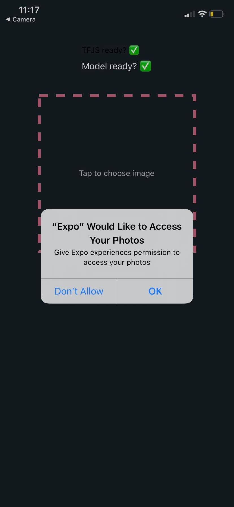
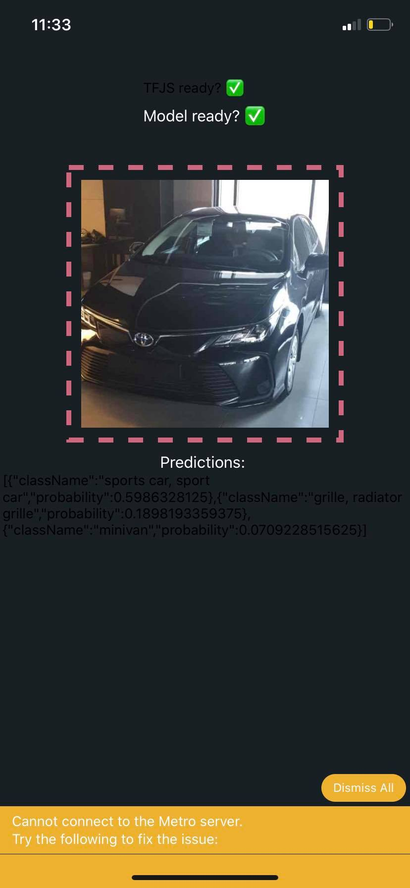

# Object Recognition using Tensorflow in React Native

It works offline.

## Sample




## How to run this code

- clone repo ```git clone https://github.com/A7madSab/object-recognition-tensorflow-react-native.git```
- install dependencies ```yarn``` or ``npm install``
- run project ``expo start``
- install Expo Client app on IPhone and scan QR code using camera
- Enjoy!!

## Errors I need help with

It won't work on Anroid devices. <br/>
<strong>Reasons:</strong>
<ol>
    <li>
        <strong>Problem:</strong> TypeError: Network request failed, fetch doesn't work on Android Cache. <a src="https://github.com/facebook/react-native/issues/10404"> Issue</a> <br/>
        <strong>Solution:</strong> Use the default fetch function not tfjs's implementation. <i>Not sure why!!</i>
    </li>
    <li>
        <strong>Problem:</strong>: FileReader.readAsArrayBuffer is not implemented <a src="https://github.com/facebook/react-native/issues/21209"> Issue</a> <br/>
        <strong>Solution:</strong> Let me know. <i>please</i>
    </li>
</ol>
